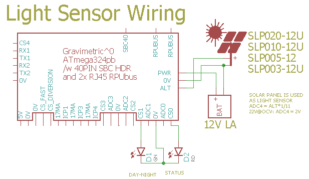

# Day-Night State Machine

## Overview

The manager has a day-night state machine that tracks voltage on the ALT_V power input (photovoltaic) to tell if it is day or night. The 324pb application controler can access the state machine over I2C.

Note: use the Day_AttachDayWork() and Night_AttachWork() functions to register a callback that will be run at the start of each day. This framework is how I debugged the day-night stat machine.


## Wiring Needed for Light Sensor



The ALT input has a [voltage divider] that is used to sense input voltage (solar pannel or a current source).

[voltage divider]: https://en.wikipedia.org/wiki/Voltage_divider


# Firmware Upload

The manager needs to be told that it has a localhost and the address to bootload. I do this with some commands on the SMBus interface from an R-Pi.

``` 
sudo apt-get install i2c-tools python3-smbus
sudo usermod -a -G i2c your_user_name
# logout for the change to take
python3
import smbus
bus = smbus.SMBus(1)
#write_i2c_block_data(I2C_ADDR, I2C_COMMAND, DATA)
#read_i2c_block_data(I2C_ADDR, I2C_COMMAND, NUM_OF_BYTES)
# what is my address
bus.write_i2c_block_data(42, 0, [255])
print("'"+chr(bus.read_i2c_block_data(42, 0, 2)[1])+"'" )
'2'
# I want to bootload address '1'
bus.write_i2c_block_data(42, 3, [ord('1')])
print("'"+chr(bus.read_i2c_block_data(42, 3, 2)[1])+"'" )
'1'
# clear the host lockout status bit so nRTS from my R-Pi on '2' will triger the bootloader on '1'
bus.write_i2c_block_data(42, 7, [0])
print(bus.read_i2c_block_data(42,7, 2))
[7, 0]
exit()
```

Or use the bootload port.

Now the serial port connection (see BOOTLOAD_PORT in Makefile) can reset the MCU and execute optiboot so that the 'make bootload' rule can upload a new binary image in the application area of flash memory.

``` 
sudo apt-get install make git picocom gcc-avr binutils-avr gdb-avr avr-libc avrdude
git clone https://github.com/epccs/Gravimetric/
cd /Gravimetric/Applications/DayNight
make
make bootload
...
avrdude done.  Thank you.
``` 

Now connect with picocom (or ilk).


``` 
#exit is C-a, C-x
picocom -b 38400 /dev/ttyAMA0
# with bootload port
picocom -b 38400 /dev/ttyUSB0
``` 

# Commands

Commands are interactive over the serial interface at 38400 baud rate. The echo will start after the second character of a new line. 

## /\[rpu_address\]/\[command \[arg\]\]

rpu_address is taken from the I2C address 0x29 (e.g. ../Uart/id.h get_Rpu_address() ). The value of rpu_address is used as a character in a string, which means don't use a null value (C strings are null terminated), but the ASCII value for '1' (0x31) is easy and looks nice.

The STATUS_LED is bliked fast (twice per second) if the I2C address is not found, also the rpu_address defaults to '0'. 

Commands and their arguments follow.


## /0/id? \[name|desc|avr-gcc\]

Identify is from ../Uart/id.h Id().

``` 
/1/id?
{"id":{"name":"DayNight","desc":"Gravimetric (17341^1) Board /w ATmega324pb","avr-gcc":"5.4.0"}}
```


## /0/day?

Report status of the state machine.

``` 
/1/day?
{"state":"4","mor_threshold":"80","eve_threshold":"40","adc_alt_v":"0","mor_debounce":"18000","eve_debounce":"18000","dn_timer":"34941"}
{"state":"4","mor_threshold":"80","eve_threshold":"40","adc_alt_v":"0","mor_debounce":"18000","eve_debounce":"18000","dn_timer":"39922"}
{"state":"4","mor_threshold":"80","eve_threshold":"40","adc_alt_v":"0","mor_debounce":"18000","eve_debounce":"18000","dn_timer":"44904"}
{"state":"4","mor_threshold":"80","eve_threshold":"40","adc_alt_v":"0","mor_debounce":"18000","eve_debounce":"18000","dn_timer":"49884"}
{"state":"4","mor_threshold":"80","eve_threshold":"40","adc_alt_v":"0","mor_debounce":"18000","eve_debounce":"18000","dn_timer":"54866"}
{"state":"4","mor_threshold":"80","eve_threshold":"40","adc_alt_v":"0","mor_debounce":"18000","eve_debounce":"18000","dn_timer":"59848"}
{"state":"5","mor_threshold":"80","eve_threshold":"40","adc_alt_v":"238","mor_debounce":"18000","eve_debounce":"18000","dn_timer":"3629"}
{"state":"5","mor_threshold":"80","eve_threshold":"40","adc_alt_v":"243","mor_debounce":"18000","eve_debounce":"18000","dn_timer":"8611"}
{"state":"5","mor_threshold":"80","eve_threshold":"40","adc_alt_v":"243","mor_debounce":"18000","eve_debounce":"18000","dn_timer":"13593"}
{"state":"1","mor_threshold":"80","eve_threshold":"40","adc_alt_v":"239","mor_debounce":"18000","eve_debounce":"18000","dn_timer":"18574"}
{"state":"1","mor_threshold":"80","eve_threshold":"40","adc_alt_v":"238","mor_debounce":"18000","eve_debounce":"18000","dn_timer":"23556"}
{"state":"1","mor_threshold":"80","eve_threshold":"40","adc_alt_v":"239","mor_debounce":"18000","eve_debounce":"18000","dn_timer":"28538"}
{"state":"1","mor_threshold":"80","eve_threshold":"40","adc_alt_v":"242","mor_debounce":"18000","eve_debounce":"18000","dn_timer":"33518"}
{"state":"2","mor_threshold":"80","eve_threshold":"40","adc_alt_v":"0","mor_debounce":"18000","eve_debounce":"18000","dn_timer":"710"}
{"state":"2","mor_threshold":"80","eve_threshold":"40","adc_alt_v":"0","mor_debounce":"18000","eve_debounce":"18000","dn_timer":"5691"}
{"state":"2","mor_threshold":"80","eve_threshold":"40","adc_alt_v":"0","mor_debounce":"18000","eve_debounce":"18000","dn_timer":"10673"}
{"state":"2","mor_threshold":"80","eve_threshold":"40","adc_alt_v":"0","mor_debounce":"18000","eve_debounce":"18000","dn_timer":"14"}
{"state":"4","mor_threshold":"80","eve_threshold":"40","adc_alt_v":"0","mor_debounce":"18000","eve_debounce":"18000","dn_timer":"4994"}
{"state":"4","mor_threshold":"80","eve_threshold":"40","adc_alt_v":"0","mor_debounce":"18000","eve_debounce":"18000","dn_timer":"9976"}


```

Callback did not run (TBD), but the state machine is working.
