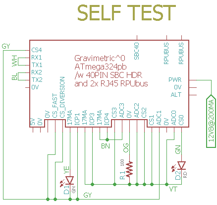

# Self-Test

## To Do

    Befor running i2c_testmode_set_xcvrbits and i2c_testmode_test_xcvrbits, turn off battery manager (which controls ALT_EN) with command 16 (e.g., set the callback address to zero).


## known issues

Use bootload port to view test, since "Remote" firmware on remote managers does not recover after test mode.

I2C0 test commands do not work after test finish (so one run after a power cycle).


## Overview

Check Board Functions, runs once after a reset and then loops in a pass/fail section.

ICP1, ICP3, and ICP4 each have a 100 Ohm resistor to 0V on board.

Voltage references are saved in EEPROM for use with Adc and other applications. Measure the +5V supply accurately and set the REF_EXTERN_AVCC value in the main.c file. The band-gap reference is calculated and also saved.

The wiring has a red and green LED that blink to indicate test status.

## Wiring Needed for Testing



not yet shown:
On ^1 rework is needed for Q105 and Q118
I2C1 on 324pb wired to SMBus on R-Pi header
+5V from bootload port pin wired to +5V on R-Pi header
all loopbacks from [XcvrTest] on R-Pi header

[XcvrTest]: https://github.com/epccs/RPUno/tree/master/XcvrTest


## Power Supply

Use a power supply with CV and CC mode. Set CC at 200mA and set CV to 12.8V then connect and power the UUT.


## Firmware Upload

With a serial port setup for serial bootloading (see BOOT_PORT in Makefile) and optiboot installed on the DUT run 'make' and and 'make bootload' to upload a binary image in the application area of flash memory.


``` 
sudo apt-get install make git picocom gcc-avr binutils-avr gdb-avr avr-libc avrdude
git clone https://github.com/epccs/Gravimetric/
cd /Gravimetric/Applications/SelfTest
make
make bootload
...
avrdude done.  Thank you.
make clean
``` 

Now connect with picocom (exit is C-a, C-x). 

``` 
#picocom -b 38400 /dev/ttyAMA0
# use bootload port
picocom -b 38400 /dev/ttyUSB0
...
Gravimetric Self Test date: Oct 18 2019
avr-gcc --version: 5.4.0
I2C provided address 0x31 from RPUadpt serial bus manager
adc reading for PWR_V: 358 int
PWR at: 12.756 V
ADC0 at ICP3&4 TERM /W all CS off: 0.000 V
ADC1 at ICP1 TERM /w all CS off: 0.000 V
ADC2 at ICP3&4 TERM /W all CS off: 0.000 V
ADC3 at ICP3&4 TERM /W all CS off: 0.000 V
ICP1 input should be HIGH with 0mA loop current: 1
CS_ICP1 on ICP1 TERM: 0.018 A
ICP1 /w 17mA on termination reads: 0
CS4 on ICP1 TERM: 0.022 A
CS_FAST on ICP1 TERM: 0.022 A
ICP3 input should be HIGH with 0mA loop current: 1
ICP3 one-shot delay: 0 mSec
ICP3 one-shot time: 2 mSec
CS_ICP3 on ICP3AND4 TERM: 0.018 A
ICP3 /w 8mA on termination reads: 0
   ADC0 reading used to calculate ref_intern_1v1_uV: 853 int
   calculated ref_intern_1v1_uV: 1085574 uV
REF_EXTERN_AVCC old value found in eeprom: 4978470 uV
REF_INTERN_1V1 old value found in eeprom: 1085791 uV
REF_EXTERN_AVCC from eeprom is same
ICP4 input should be HIGH with 0mA loop current: 1
CS_DIVERSION on ICP1 TERM: 0.022 A
CS_ICP4 on ICP4_TERM: 0.019 A
ICP4 /w 17mA on termination reads: 0
ICP4 one-shot delay: 0 mSec
ICP4 one-shot time: 2 mSec
PWR_I at no load : 0.010 A
CS0 on ICP3_TERM: 0.022 A
CS1 on ICP3_TERM: 0.022 A
CS2 on ICP3_TERM: 0.022 A
CS3 on ICP3_TERM: 0.022 A
TX1 loopback to RX1 == HIGH
TX1 loopback to RX1 == LOW
TX2 loopback to RX2 == HIGH
TX2 loopback to RX2 == LOW
SMBUS cmd 0 provided address 49 from manager
MISO loopback to MOSI == HIGH
MISO loopback to MOSI == LOW
SCK with Shutdown loopback == HIGH
I2C0 Shutdown cmd is clean {5, 1}
SCK with Shutdown loopback == LOW
I2C0 Shutdown Detect cmd is clean {4, 1}

Testmode: default trancever control bits
I2C0 Start Test Mode cmd was clean {48, 1}
I2C0 End Test Mode hex is Xcvr cntl bits {49, 0xD5}
Testmode: read  Xcvr cntl bits {50, 0xE2}
PWR_I /w no load using REF_EXTERN_AVCC: 0.011 A

Testmode: nCTS loopback to nRTS
I2C0 Start Test Mode cmd was clean {48, 1}
I2C0 End Test Mode hex is Xcvr cntl bits {49, 0xD5}
Testmode: set  Xcvr cntl bits {51, 0xA2}
Testmode: read  Xcvr cntl bits {50, 0x22}

Testmode: Enable TX pair driver
 I2C0 Start Test Mode cmd was clean {48, 1}
I2C0 End Test Mode hex is Xcvr cntl bits {49, 0xD5}
Testmode: set  Xcvr cntl bits {51, 0xF2}
Testmode: read  Xcvr cntl bits {50, 0xF2}
PWR_I /w TX pair load: 0.031 A

Testmode: Enable TX & RX(loopback) pair drivers
 I2C0 Start Test Mode cmd was clean {48, 1}
I2C0 End Test Mode hex is Xcvr cntl bits {49, 0xD5}
Testmode: set  Xcvr cntl bits {51, 0xD1}
Testmode: read  Xcvr cntl bits {50, 0xD1}
PWR_I /w TX and RX pairs loaded: 0.053 A
RX loopback checked

Testmode: Enable DTR pair driver
I2C0 Start Test Mode cmd was clean {48, 1}
I2C0 End Test Mode hex is Xcvr cntl bits {49, 0xD5}
Testmode: set  Xcvr cntl bits {51, 0xE6}
Testmode: read  Xcvr cntl bits {50, 0xE6}
PWR_I /w DTR pair load: 0.031 A
[PASS]
```

