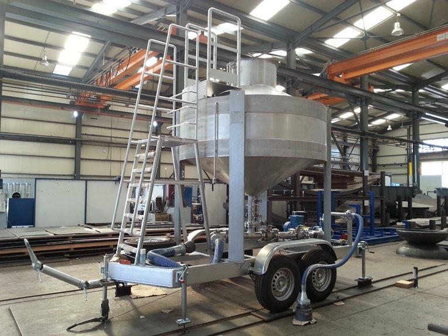

# Time-WeightCal

## Overview

This firmware is not done; it is aimed at helping to understand the time-weight gravimetric calibration method for liquid metering devices. Essentially this method consists of a bucket on a scale with a stopwatch to time the filling of the bucket. The bucket can be a large tank, and the scale highly accurate. This board provides the stopwatch with sensor-based timing and a crystal-controlled clock.

Gravimetric calibration incorporates reservoir tanks, pumps, diverter valves, and flow straighteners. After setting the desired flow rate for the calibration run, the diverter valve STARTS a calibration by changing from the flow loop path to the measured reservoir (e.g., into the holding tank). At the end of the run, the diverter valve returns the fluid flow to the regular flow loop again, and the system weighs the diverted volume of fluid to determine a mass that corresponds with the flow meters flow count.

I will deal with integers on the MCU so for fun I am going to call this Graviton. It will be an interactive command-line program that demonstrates control options of this board to do Gravimetric calibration, the program source documents how that is achieved. 

Water is diverted into a tank for a time determined by the ICP3 (START) and ICP4 (STOP) events. The weight of the collected water is measured. The pulses from a flow meter are input with ICP1 between the START and STOP time to calculate a meter constant (the meters K factor). 

A program running on a host computer will take the integers (e.g., pulse counts, timing counts, timing events) and calculate floating-point values (e.g., the meter K factor). The AVR's single time-domain keeps the relation between events, counts, and control simple; it is accurate to within one crystal clock. A high-speed MCU that runs with a clock derived from a PPL and input pins in their time domain is very likely less precise. In this occasion, the simple AVR time-domain means a more repeatable measurement with accuracy that is wholly dependent on the crystal accuracy without any wordsmithing (e.g., no Double-Timing Pulse Interpolation.) Once the precision data is collected, it can be passed to the sausage factory that is a modern computer for processing and networking. An FPGA could do this also, but there is several MCU's that have surfactant capture hardware to do the task.

./Waterdraw-vs-Gravimetric.pdf

## Scale

There is a range of industrial scales that have RS232; for the most part, they will print an output when a button is pushed or take a command (e.g., 'S' is often a request for weighing after stable). Use a [shifter] to convert RS232 to CMOS logic for the AVR. The Avery Weight-Tronix [BSQ Bench] is the calibrated gold option.

[shifter]: https://www.sparkfun.com/products/449
[BSQ Bench]: https://www.averyweigh-tronix.com/globalassets/products/bench-scales/bsq/bsq_spec_501488v3.pdf

Another option is to build a scale with load cells and an IC like the NAU7802 or HX711, but the truth is if it is not calibrated, then this exercise is absurd.

For development I will input data from another serial device (e.g., USBuart or a ICSP /w an R-Pi).

If the scale has is a mechanical oscillation, it might be possible to put a dashpot on the corners to dampen out the oscillations. The trick is not to have any parts of the damper touching the cylinder.

https://en.wikipedia.org/wiki/Dashpot

Also, fast-fill to 90% and then slow-fill with a weir on the slow fill end to the setpoint. The gradual fill and weir will reduce the disturbance on the scale.

https://en.wikipedia.org/wiki/Weir

Ther is always an overshoot, but if it is predictable, we can turn off the flow that much before the set-point.


## Partial Pulse

An incomplete pulse time will be found between the Start and Stop events. Keep track of the first and last pulse from the Flowmeter and use that to figure out how much is needed to finish the time between Start and Stop.  Things that are done in the MCU are in C. 

``` C
// done on MCU
StartFTcnt = ICP1cnt_at_ICP3_event
StartFTbuffer = ICP1_events[] # saved after ICP3 event
Start = ICP3_event
StopFTcnt = ICP1cnt_at_ICP4_event
Stop = ICP4_event
StopFTbuffer = ICP1_events[] # saved after ICP4 event
Partial = (Stop - Start) - (StopFTbuffer[0] - StartFTbuffer[0])
```

Things that are done on the SBC can be done with Python. The integer values are transfered in JSON from the MCU to the SBC. 

``` Python
# done on SBC with floating point
# the average event time rate of pulse near the Stop
repeat = 8
valid_flow = repeating(StartFTbuffer, repeat) & repeating(StopFTbuffer, repeat)
if valid_flow:
    FTcnt_rate = ( (1.0 * (StartFTbuffer[0] - StartFTbuffer[7]) / repeat) + (1.0 * (StopFTbuffer[0] - StopFTbuffer[7]) / repeat) ) / 2
    if ( (Partial * 1.0) > (FTcnt_rate * 2.0) ): print "Warning: partial pulse time is to large"
    Weight = read_stable_scale()
    FTpulses = (StopFTcnt - StartFTcnt) +  (Partial / FTcnt_rate)
    WtPerFT = Weight / FTpulses
```

A slow flow rate during the Start and Stop events can improve the calibration, but the partial pulse calculation needs to be done based on the average of some of the slow pulses found near the Stop event. The ICP1 capture buffer is saved at the Start and Stop signal. The capture buffer also needs checked for repeating captures (e.g., steady flow rate).   


## Volume

Convert the weight per flow pulse into volume. 

```
# the nominal value is in g/cm3
density_of_water = 0.997239
density_of_air = 0.001119
```

Type II Electronic balance weights density is approximately 7.84g/cm3. This application involves the calibration of a Class II balance with an ASTM Class 4, 5 and 6 weight(s) manufactured in accordance with ASTM E 617-97 specification and tolerances.

```
density_correction = (1+ density_of_air*( (1/density_of_water) - (1/7.84)))
water_mass_collected = water_weight * density_correction
volume_start_to_stop = water_mass_collected / density_of_water
```

The instrument to be proven may have other correction factors that need to be applied to the volume, for example a volume prover will need corrections for both temperature and pressure.


# Calibration

The idea is to base flow measurements on a known standard, and then have that be the top of a hierarchy (like a file system root directory). A volume is measured with displaced water, and that is what gets weighed. The scale needs to be calibrated to a reference in the hierarchy of known standards, and the properties of water are considered reliable.




# Time Base Calibration

Capture the 1PPS of the GPS receiver for some time to measure the time base (oscillator). It has been reported that an RTC can be measured to within 0.5ppm in 61 seconds. RTC typically run at 32kHz and were probably clocking the capture timer directly if that is possible (TBD).


# Networking

If your printers lock up unexpectedly, it may be because they were port scanned, and an overflow crashed the printer software; it is a clue about being owned. Do not throughout the printer; it is your friend because it tells the truth.

https://arstechnica.com/information-technology/2020/02/a-us-gas-pipeline-operator-was-infected-by-malware-your-questions-answered/?comments=1&post=38660092

Note the idea of "operational historian", I need to consider how that should be implemented.
