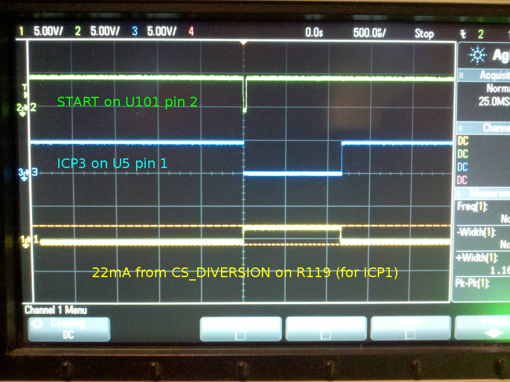
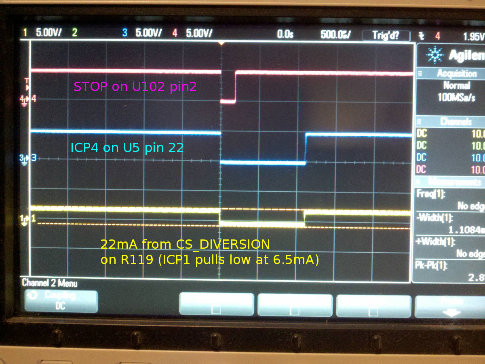
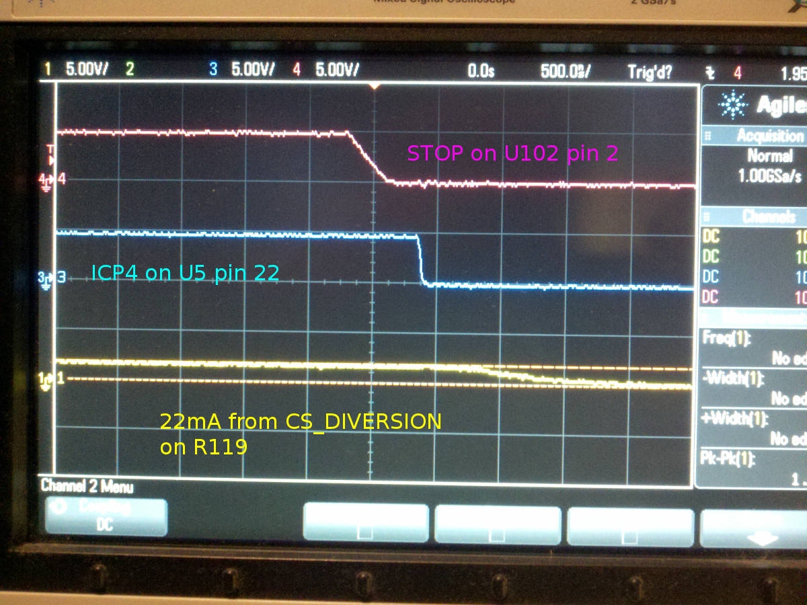
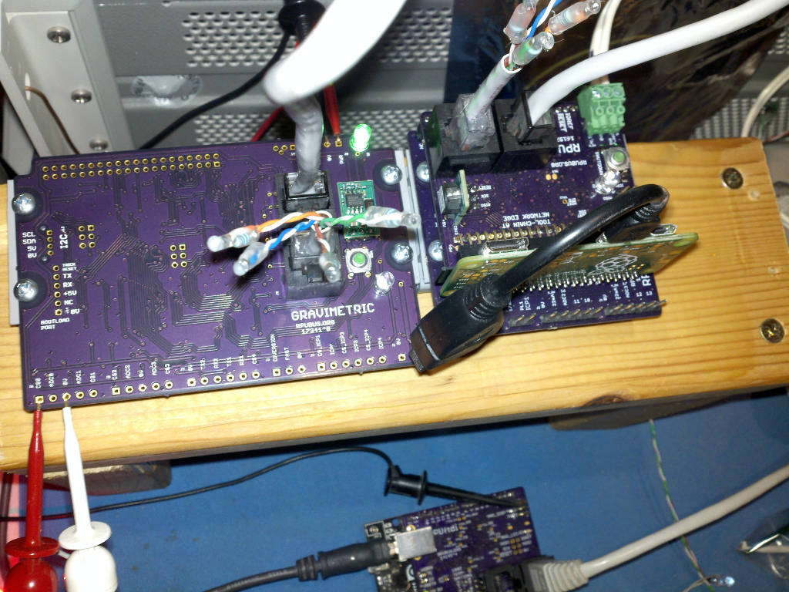
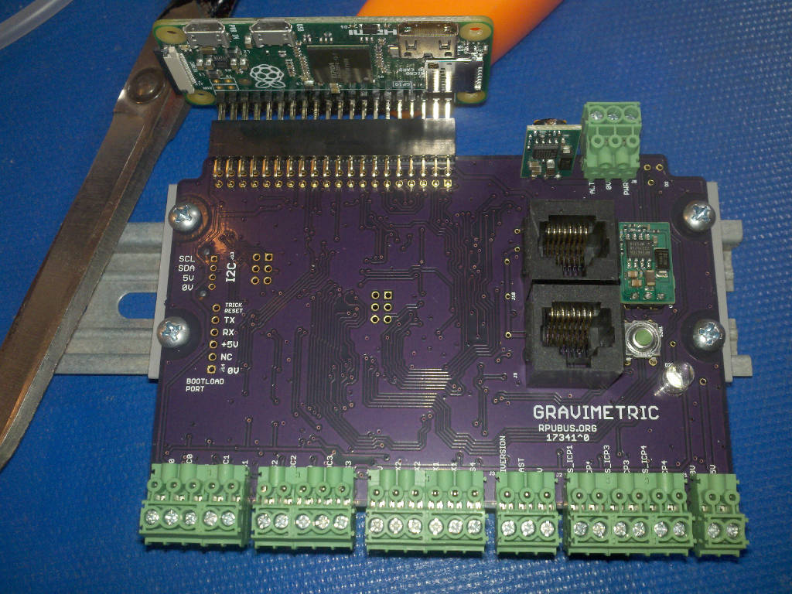
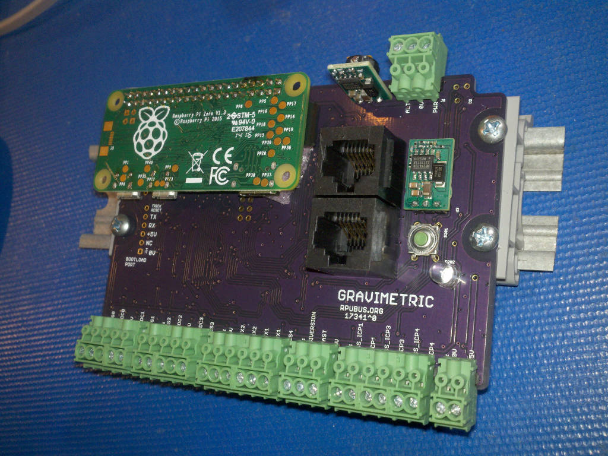
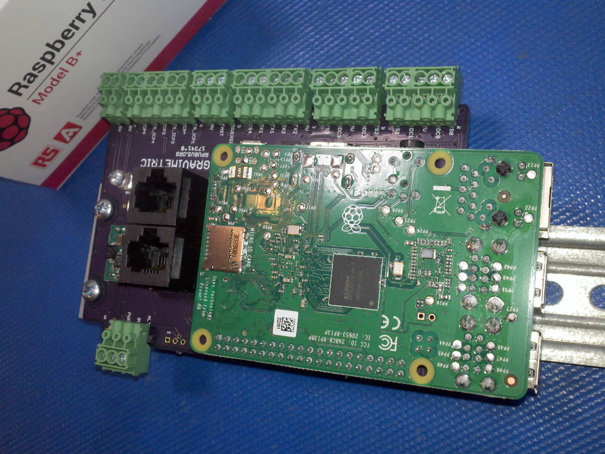
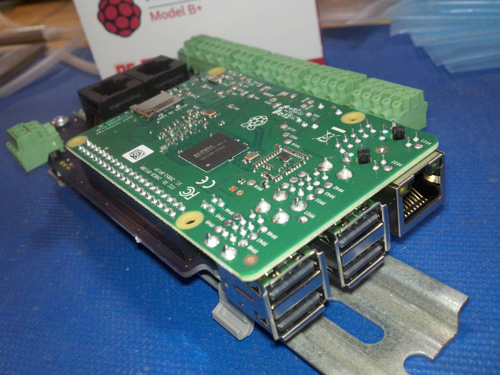

# Description

This shows the setup and method used for evaluation of Gravimetric.

# Table of References


# Table Of Contents:

1. ^1 UART sneaky mode
1. ^0 Start One Shot
1. ^0 Stop One Shot
1. ^0 Alternat Power Modified
1. ^0 Bootload
1. ^0 Bootloader and Manager fw
1. ^0 Mockup


## ^1 UART sneaky mode

Use picocom to connect to an application controller without enabling the host lockout status bit (see manager's I2C command 7).

``` 
# are my in the dialout group
[sudo apt install members]
members dialout
# no I am not
sudo usermod -a -G dialout rsutherland
# logout for the change to take
picocom -b 38400 /dev/ttyAMA0
...
Terminal ready
/1/id?
{"id":{"name":"I2C1debug^2","desc":"Gravimetric (17341^1) Board /w ATmega324pb","avr-gcc":"5.4.0"}}
``` 

The sneaky mode is a mistake that I use too much to fix. When state information is received on the DTR pair, the sneaky mode is done.


## ^0 Start One Shot

The pulse extender (one-shot) is evident in the image. The START input is toggled for 50uSec, and the One-Shot holds the ICP3 pin for about 1100 uSec. The CS_DIVERSION is sending 22mA to the ICP1 input resistor (100 Ohm, R119), and it is on during the One-Shot.



Changing the time scale to 500 nSec/div we can see what the hardware signal timing looks like, the timing is fixed by hardware and is repeatable (e.g., this does not reduce measurement repeatability).


Reworked Q105 and Q118 was done to fix N-CH Cutoff issue noted in schooling for this.


## ^0 Stop One Shot

The pulse extender (one-shot) is evident in the image. The STOP input is toggled for 200uSec, and the One-Shot holds the ICP4 pin for about 1100 uSec. The CS_DIVERSION is sending 22mA to the ICP1 input resistor (100 Ohm, R119), and it is cut off during the One-Shot.



Changing the time scale to 500 nSec/div we can see what the hardware signal timing looks like, the timing is fixed by hardware and is repeatable (e.g., this does not reduce measurement repeatability).



Reworked Q105 and Q118 was done to fix N-CH Cutoff issue noted in schooling for this.


## ^0 Alternat Power Modified

Alternate power has been modified so that D1 was replaced with a P-channel MOSFET with source facing Q2, and its gate tied to the gate of Q2. 

R1 used for ALT_V was cut and tied directly to ALT input. 

R4 was moved between the source of Q2 and the new P-channel MOSFET. 

Power protection was verified to work (e.g., backward polarity) while ALT_EN is off.

ALT_I checked. 

ALT_V checked. 

[DayNight] state machine, and [Alternat] power charging on a 12V battery checked.

[DayNight]: https://github.com/epccs/Gravimetric/tree/master/Applications/DayNight
[Alternat]: https://github.com/epccs/Gravimetric/tree/master/Applications/Alternat

These changes will show up on ^1, so they were hacked onto ^0 for evaluation.


## ^0 Bootload

Compile and bootload the BlinkLED firmware from an R-Pi Zero on a RPUpi^6 (on RPUno^9) over the RPUbus. 

The RPUpi^6 manager works with this manager at this time (other shields do not).



As you can see, the R-Pi header and its POL are not used; it is remote or foreign relative to the host.


## ^0 Bootloader and Manager fw

I was not able to install with the ICSP and R-Pi Zero for reasons that are not yet clear, but the ArduinoISP sketch worked and the board firmware installed. I will backtrack to the ICSP as time allows, next is to verify the bootloader works with the BlinkLED fw which needs Uart and Timer drivers, then I need the ADC drivers for the self-test. 


## ^0 Mockup

Parts are not soldered, they are just resting in place, the headers are in separate BOM's and not included unless specified (they are expensive but in some cases worth the cost).



With Horizontal Raspberry Pi Zero



With Horizontal Raspberry Pi 3B+ (note the POL is missing)



side view



The fit is surprisingly good. The edge of the ethernet connector is over the Gravimetric board just enough. The ethernet connector is resting on the plastic DIN rail clip. I suspect that an additional DIN clip could have some hook and loop (Velcro) placed on it and the top of the Ethernet header to fasten the board. One thing to note is that the screw head holding the Gravimetric board to the DIN rail clip needs some filing, so its edge does not go over the side of the Gravimetric board.

The computing power of a R-Pi 3 B+ is significant. It has a quad core Cortex-A53 (ARMv8) 64-bit SoC running at 1.4GHz. Unfortunately it needs 2.5A at 5V, and I have yet to find an option I like for the POL, I want it to turn 7V thru 36V into 5V@3A.

The R-Pi has a lot of approval certificates now days, so it is a choice for areas that need that sort of stuff.

https://www.raspberrypi.org/documentation/hardware/raspberrypi/conformity.md