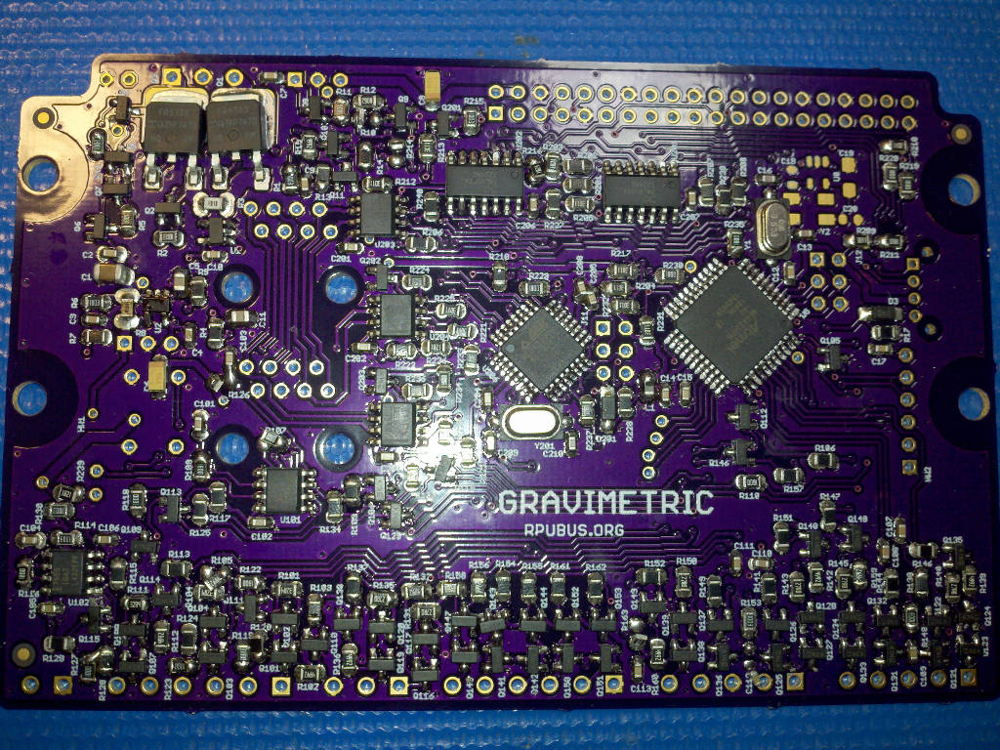

# Hardware

## Overview

This board has an ATmega324pb and is setup for using the three timers (Timer1, Timer3, Timer4) that have input capture (ICP) hardware. The main idea is to calibrate flow meters, so that means it needs to do the measurements for a flow meter [prover]. ICP1 is used with the flow meter which produces pulses with each unit of volume (a magnet on a spinning turbine triggering a sensor). ICP3 is used to measure a volume start event, and ICP4 a stop event. A one-shot pulse extender is used with the ICP3 and ICP4 inputs. Gravimetric proving is fairly easy with a flow meter alone but it is more involved with a volume prover. The volume prover needs to have a diversion operate in a way I'm going to liken to a bistable switch. The diversion will fill a bucket (or ilk) that can be weighted. The trick is that the one-shot that feds ICP3 on the ATmega324pb is also used to start the diversion and the ISR that ICP3 runs needs to set a pull-up to keep the diversion going. The pull-up also enables the one-shot that feds ICP4 (stop event) and will override the pull-up and thus change the diversion control. The ISR that ICP4 runs needs to clear the pull-up so the diversion will stay off after the ICP4 one-shot ends. The result is that flow is diverted from the instant start occurs to the instant stop occurs. One helpful thing to do is slow the flow near the start and stop events, but that requires the magic of a computer (the R-Pi) and estimates of when those events will occur in relation to the flow meter pulse counts.

[prover]: http://asgmt.com/wp-content/uploads/2016/02/011_.pdf

Bootloader options include [optiboot] and [xboot]. Serial bootloaders can't change the hardware fuse setting which reduces programming errors that can accidentally brick the controller. 

[optiboot]: https://github.com/Optiboot/optiboot
[xboot]: https://github.com/alexforencich/xboot

## Inputs/Outputs/Functions

```
        ATmega324pb programs are compiled with open source tools.
        Input power can range from 7 to 36V DC
        High side current sense of alternat input power is connected to ADC5.
        High side current sense of input power is connected to ADC6.
        Input power voltage is divided down and connected to ADC7.
        Five analog (CH 0..4) or digital (numbers TBD) connections with level conversion.
        Three inputs for event capture: ICP1, ICP3, ICP4.
        Two of the event capture inputs have a 50mSec one shot pulse extender: ICP3, ICP4.
        The event capture for ICP4 only occures if the diversion control pullup is active.
        Event timers have a common crystal which eliminates correlation errors.
        Event capture interface has a 17mA current source for sensor (hall, VR, or just a limit switch)
        Event transition occures at about 6.5mA of current returned from the sensor to a 100 Ohm resistor on board.
        TBD controls a PMOS that enables an alternate power supply (e.g. battery charging).
        SPI pins are dedicated for connection to the shield with the ICSP header.
```

## Uses

```
        Calibration of rotating hardware measured with input capture (ICP) hardware.
        Use a start and stop sensor to capture a displacer while capturing flow meter pules.
        Diversion and fast/slow flow control can be used for gravimetric calibration. 
        One-shot pulse extenders on ICP3 and ICP4 for clean switch event measurements (e.g. a start and stop).
```

## Notice

```
        AREF from ATmega324pb is not connected to the header.
        3V3 is not present on the board, the header pin is not connected.
```


# Table Of Contents

1. [Status](#status)
2. [Design](#design)
3. [Bill of Materials](#bill-of-materials)
4. [Assembly](#assembly)
5. [How To Use](#how-to-use)


# Status


```
        ^0  Done:  
            WIP: Design (Overhaul... it never got past the review)
            Todo: Layout, BOM, Review*, Order Boards, Assembly, Testing, Evaluation.
            *during review the Design may change without changing the revision.
            use 324pb MCU not 328pb.
            add high side current sense connected to ADC5 for alternat input power.
            add serial1 (like Irrigate7) so an R-Pi can access a load cell (e.g. HX711) though the control board.
            add two one-shot circuits trigered when ICP3 and ICP4 are.
            add current sources to signal SSR's that can power FAST_FLOW and DIVERSION valves for gravimetric proving.
            the FAST_FLOW current source should be self explaing enough, e.g. if it is off then flow is slow.
            the gravimetric DIVERSION control current source needs to turn on when ICP3 one-shot does (e.g. start flow onto scale).
            the DIVERSION control current source needs to be held on by an MCU pin setup as a pullup that the ICP3 ISR can turn on.
            the DIVERSION current source needs to be forced off when the ICP4 one-shot is active (the ICP4 ISR can then turn off the pullup).
            the event capture for ICP4 only occures if the diversion control pullup is active.
            add current sources to signal a prover LAUNCH.
            add digital input to signal when prover is READY and handshake when the launch occured (set for slow flow in 4, 3, 2, 1...).
```

Debugging and fixing problems i.e. [Schooling](./Schooling/)

Setup and methods used for [Evaluation](./Evaluation/)


# Design

The board is 0.063 thick, FR4, two layer, 1 oz copper with ENIG (gold) finish.





## Electrical Parameters (Typical)

```
TBD
```

## Mounting

```
DIN rail
```

## Electrical Schematic


## Testing

Check correct assembly and function with [Testing](./Testing/)


# Bill of Materials

The BOM is a CVS file(s), import it into a spreadsheet program like LibreOffice Calc (or Excel), or use a text editor.

Option | BOM's included
----- | ----- 
A. | [BRD] 
M. | [BRD] [SMD] [HDR] 
W. | [BRD] [SMD] [HDR] [PLUG]
Z. | [BRD] [SMD] [HDR] [PLUG] [DIN]

[BRD]: ./Design/17341BRD,BOM.csv
[SMD]: ./Design/17341SMD,BOM.csv
[HDR]: ./Design/17341HDR,BOM.csv
[PLUG]: ./Design/17341PLUG,BOM.csv
[DIN]: ./Design/17341DIN,BOM.csv


# Assembly

## SMD

The board is assembled with CHIPQUIK no-clean solder SMD291AX (RoHS non-compliant). 

The SMD reflow is done in a Black & Decker Model NO. TO1303SB which has the heating elements controlled by a Solid State Relay and an RPUno loaded with this [Reflow] firmware.

[Reflow]: ../Reflow


# How To Use

## Prevent overcharging a battery

A do it yourself approach to prevent overcharging a battery by using the alternate power input with a solar panel.

Use IO9 to open circuit the solar panel connected to the alternate power input. This input will only tolerate up to about 1 amp so make sure the short circuit current is less than that.


## A functional view

For calibration, this hardware provides data acquisition only. It does not try to deal with machine control, e.g. the operations necessary to launch a displacer through a known volume. In this case, the measurement task and its data acquisition is seen as a separate function and has been compartmentalized as such, it has ignored the aspects of machine control. Reducing complexity can help yield a working tool. Retaining the complexity required to provide a function makes the tool useful. 

