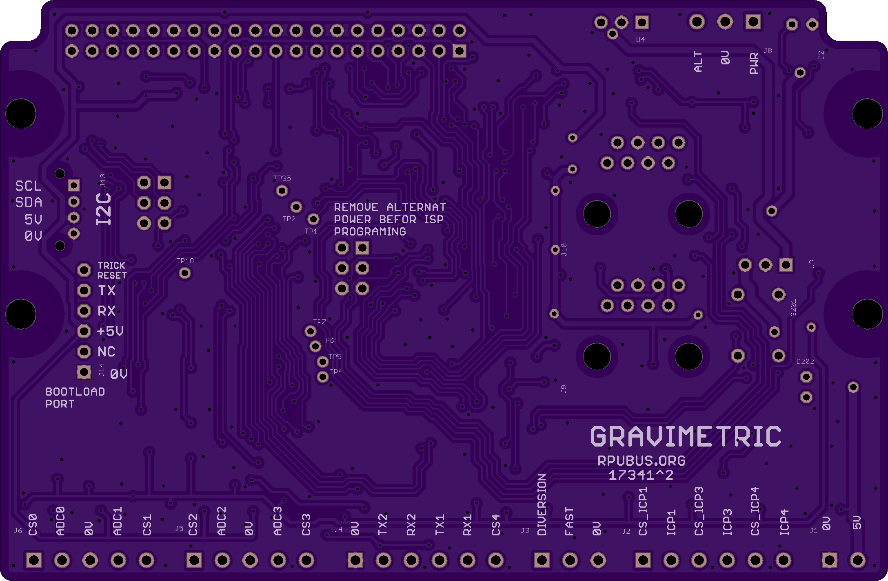

# Hardware

## Overview

This board has an ATmega328pb and is setup for using the three timers (Timer1, Timer3, Timer4) that have capture hardware. The reset is TBD.

Bootloader options include [optiboot] and [xboot]. Serial bootloaders can't change the hardware fuse setting which reduces programming errors that can accidentally brick the controller. 

[optiboot]: https://github.com/Optiboot/optiboot
[xboot]: https://github.com/alexforencich/xboot

## Inputs/Outputs/Functions

```
        ATmega328p programs are compiled with open source tools.
        Input power can range from 7 to 36V DC
        High side current sense of input power is connected to ADC6.
        Input power voltage is divided down and connected to ADC7.
        Three digital or analog input/outputs (D14/ADC0,D15/ADC1,D16/ADC3) with level conversion.
        Three inputs for event capture: ICP1, ICP3, ICP4.
        Event timers have a common crystal which eliminates correlation error.
        Event transition occures at about 6.5mA of flowing loop current on a 100 Ohm resistor.
        IO9 controls a PMOS that enables an alternate power supply (e.g. solar).
        SPI pins are available for connection to a host computer (e.g. master ) or sd card (e.g. slave) on the shield
```

## Uses

```
        Calibration of rotating hardware measured with capture.
        Use a start and stop flag to capture a distance or displacement while capturing rotation.
```

## Notice

```
        AREF from ATmega328pb is not connected to the header.
        3V3 is not present on the board, the header pin is not connected.
```


# Table Of Contents

1. [Status](#status)
2. [Design](#design)
3. [Bill of Materials](#bill-of-materials)
4. [Assembly](#assembly)
5. [How To Use](#how-to-use)


# Status


```
        ^0  Done: Design, Layout, 
            WIP: BOM,
            Todo: Review*, Order Boards, Assembly, Testing, Evaluation.
            *during review the Design may change without changing the revision.
```

Debugging and fixing problems i.e. [Schooling](./Schooling/)

Setup and methods used for [Evaluation](./Evaluation/)


# Design

The board is 0.063 thick, FR4, two layer, 1 oz copper with ENIG (gold) finish.





## Electrical Parameters (Typical)

```
TBD
```

## Mounting

```
DIN rail
```

## Electrical Schematic


## Testing

Check correct assembly and function with [Testing](./Testing/)


# Bill of Materials

The BOM is a CVS file(s), import it into a spreadsheet program like LibreOffice Calc (or Excel), or use a text editor.

Option | BOM's included
----- | ----- 
A. | [BRD] 
M. | [BRD] [SMD] [HDR] 
W. | [BRD] [SMD] [HDR] [PLUG]
Z. | [BRD] [SMD] [HDR] [PLUG] [DIN]

[BRD]: ./Design/17341BRD,BOM.csv
[SMD]: ./Design/17341SMD,BOM.csv
[HDR]: ./Design/17341HDR,BOM.csv
[PLUG]: ./Design/17341PLUG,BOM.csv
[DIN]: ./Design/17341DIN,BOM.csv


# Assembly

## SMD

The board is assembled with CHIPQUIK no-clean solder SMD291AX (RoHS non-compliant). 

The SMD reflow is done in a Black & Decker Model NO. TO1303SB which has the heating elements controlled by a Solid State Relay and an ATMega328p loaded with this [Reflow] firmware.

[Reflow]: ../Reflow


# How To Use

## Prevent overcharging a battery

A do it yourself approach to prevent overcharging a battery by using the alternate power input with a solar panel.


Use IO9 to open circuit the solar panel connected to the alternate power input. This input will only tolerate up to 2 amps so make sure the short circuit current is less than that.


## A functional view

For calibration, this hardware provides data acquisition only. It does not try to deal with machine control, e.g. the operations necessary to launch a displacer through a known volume. In this case, the measurement task and its data acquisition is seen as a separate function and has been compartmentalized as such, it has ignored the aspects of machine control. Reducing complexity can help yield a working tool. Retaining the complexity required to provide a function makes the tool useful. 

