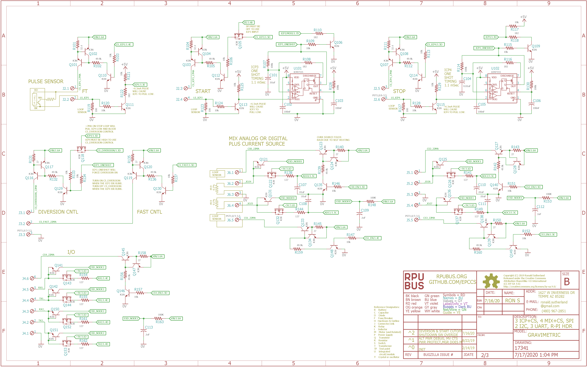
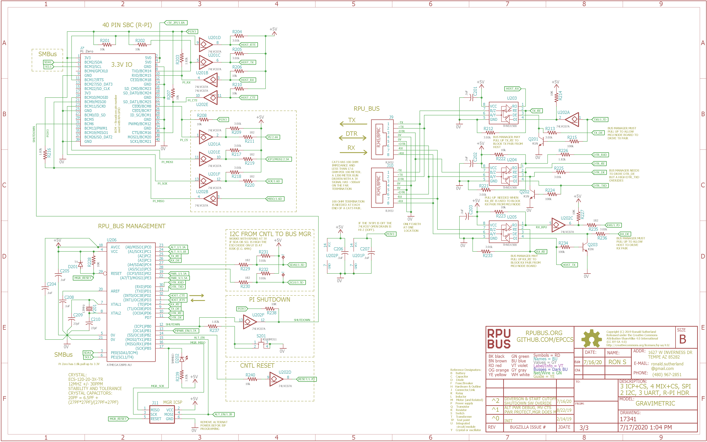

# Hardware

## Overview

This board has an ATmega324pb which has three timers (Timer1, Timer3, Timer4) that have input capture (ICP) hardware. The main idea is to calibrate flow meters with a gravimetric method, so that means it needs to capture flow meter events (pulses) and calibrate them with a volume corrected weight. This method can also be used for [prover]. ICP1 is used with the flow meter which produces pulses as a unit of volume flows (e.g. a magnet on a spinning turbine triggering a sensor). ICP3 is used to measure a volume start event and ICP4 a stop event. A one-shot pulse extender is used with the ICP3 and ICP4 inputs. Gravimetric proving is fairly easy with a flow meter alone but may also benefit from ideas found on volume provers. To do a gravimetric calibration on a volume prover a diversion needs to operate in a way I'm going to liken to a bistable switch. The diversion fills a bucket (or ilk) that will be weighted. The one-shot that feds ICP3 on the ATmega324pb is also used to start the diversion and the ISR that ICP3 runs enables a pin that holds the diversion. The ICP4 (stop event) has a way to override the hold on the diversion control. The ISR that ICP4 runs needs to disable the pin that holds the diversion so it will stay off after the ICP4 one-shot ends. The result is that flow is diverted from the instant START occurs to the instant STOP occurs. One helpful thing to do is slow the flow near the start and stop events, but that requires the magic of a computer (and SBC like an R-Pi) and estimates of when those events will occur in relation to the flow meter pulse counts.

[prover]: http://asgmt.com/wp-content/uploads/2016/02/011_.pdf

Bootloader options include [optiboot] and [xboot]. Serial bootloaders can't change the hardware fuse setting which reduces programming errors that could accidentally brick the controller. 

[optiboot]: https://github.com/Optiboot/optiboot
[xboot]: https://github.com/alexforencich/xboot

## Inputs/Outputs/Functions

```
        ATmega324pb programs are compiled with open source tools.
        Input power can range from 7 to 36V DC
        Alternat input voltage is divided down and connected to ADC4.
        High side current sense of alternat input power is connected to ADC5.
        High side current sense of input power is connected to ADC6.
        Input power voltage is divided down and connected to ADC7.
        Four analog (CH 0..3) or digital connections with level conversion.
        Three inputs for event capture: ICP1, ICP3, ICP4.
        Two of the event capture inputs have a one shot pulse extender: ICP3, ICP4.
        Event timers have a common crystal which eliminates correlation errors.
        Event capture interface has a 17mA current source for sensor (hall, VR, or just a limit switch)
        Event transition occures at about 6.5mA of current returned from the sensor to a 100 Ohm resistor on board.
        Diversion control use ICP3 to START and ICP4 to STOP, and there ISR's to operate the CS_DIVERSION holding pin.
        Diversion control is nearly instantaneous with a slight delay that has repeatable timing.
        Control of a PMOS enables an alternate power supply (e.g. battery charging).
        Control of a PMOS disables power to the 40PIN SBC header.
        SPI between SBC and ATmega324pb has a buffer with IOFF for SBC power off.
        UART from SBC to transceivers has a buffer with IOFF for SBC power off.
        I2C between SBC and bus manager is for SMBus and so SBC can power off.
        I2C between ATmega324pb and bus manager is on a seperate port.
        Serial (RPUbus) continues working when SBC is powered off.
```

## Uses

```
        Calibration of rotating hardware measured with input capture (ICP) hardware.
        Use a START (ICP3) and STOP (ICP4) sensor to capture displacer events while capturing flow meter pules.
        Diversion and fast/slow flow control are useful for gravimetric calibration methods. 
        One-shot pulse extenders on ICP3 and ICP4 for clean STAR and STOP switch events.
```

## Notice

```
        AREF from ATmega324pb is not connected to the header.
        3V3 is not present on the board, the header pin is not connected.
        Using SPI may trigger ICP3 if it is enabled and will cut off CS_ICP3.
```


# Table Of Contents

1. [Status](#status)
2. [Design](#design)
3. [Bill of Materials](#bill-of-materials)
4. [Assembly](#assembly)
5. [How To Use](#how-to-use)


# Status


```
        ^0  Done: Design, Layout, BOM, Review*, Order Boards, Assembly,
            WIP: Testing,
            Todo: Evaluation.
            *during review the Design may change without changing the revision.
```

Debugging and fixing problems i.e. [Schooling](./Schooling/)

Setup and methods used for [Evaluation](./Evaluation/)


# Design

The board is 0.063 thick, FR4, two layer, 1 oz copper with ENIG (gold) finish.


## Mounting

```
DIN rail
```

## Electrical Schematic






## Testing

Check correct assembly and function with [Testing](./Testing/)


# Bill of Materials

The BOM's are CVS files, import them into a spreadsheet program like Excel (or LibreOffice Calc), or use a text editor.

Option | BOM's included
----- | ----- 
A. | [BRD]
J. | [BRD] [SMD] [HDR]
M. | [BRD] [SMD] [HDR] [CAT5]
N. | [BRD] [SMD] [HDR] [CAT5] [POL]
Y. | [BRD] [SMD] [HDR] [CAT5] [POL] [DIN] [PLUG] 


[BRD]: ./Design/17341BRD,BOM.csv
[CAT5]: ./Design/17341CAT,BOM.csv
[DIN]: ./Design/17341DIN,BOM.csv
[HDR]: ./Design/17341HDR,BOM.csv
[PLUG]: ./Design/17341PLUG,BOM.csv
[POL]: ./Design/17341POL,BOM.csv
[SMD]: ./Design/17341SMD,BOM.csv
[TCOX]: ./Design/17341TCOX,BOM.csv

# Assembly

## SMD

The board is assembled with CHIPQUIK no-clean solder SMD291AX (RoHS non-compliant). 

The SMD reflow is done in a Black & Decker Model NO. TO1303SB which has the heating elements controlled by a Solid State Relay and an RPUno loaded with this [Reflow] firmware.

[Reflow]: ../Reflow


# How To Use

TBD

