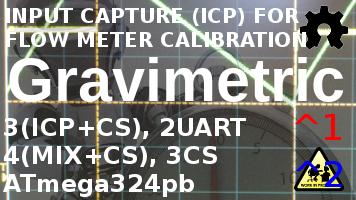
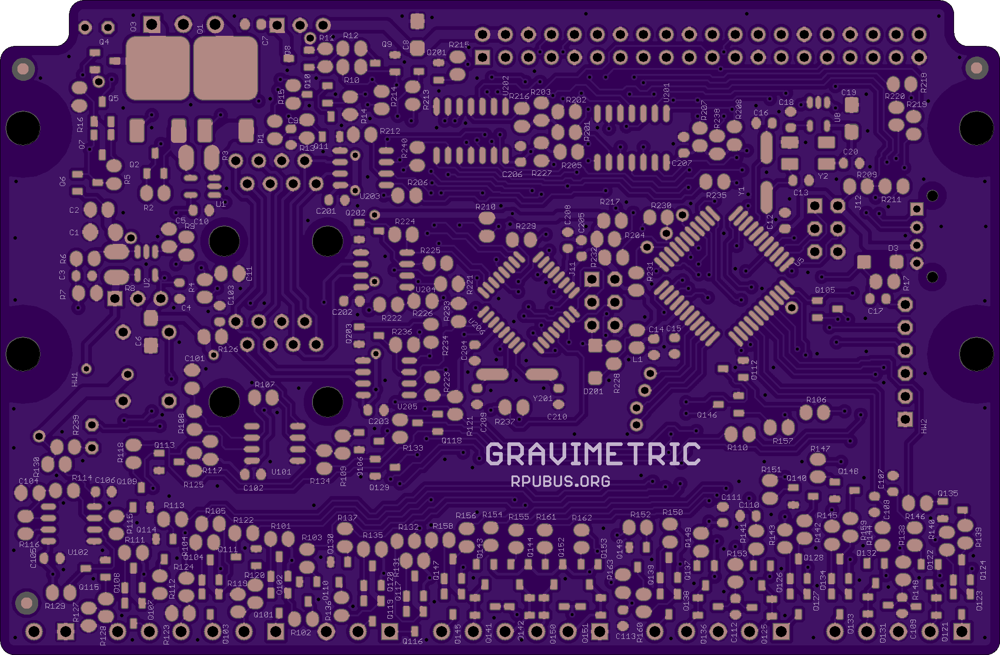
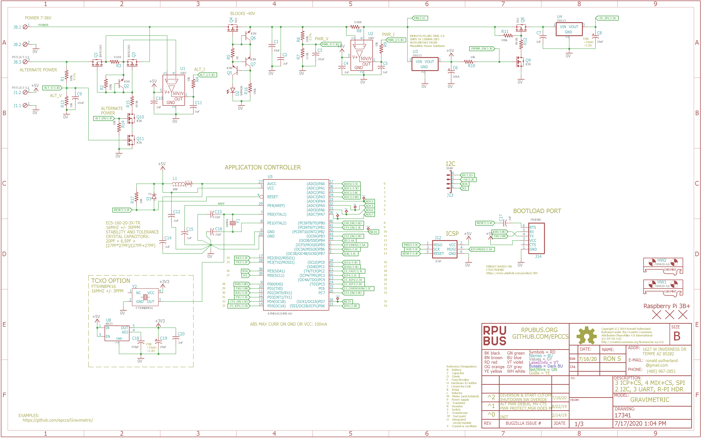

# Hardware

## Overview

This board has an ATmega324pb which has three timers (Timer1, Timer3, Timer4) that have input capture (ICP) hardware. The main idea is to calibrate flow meters with a gravimetric method, so that means it needs to capture flow meter events (pulses) and calibrate them with a volume corrected weight. This method can also be used for [prover]. ICP1 is used with the flow meter which produces pulses as a unit of volume flows (e.g. a magnet on a spinning turbine triggering a sensor). ICP3 is used to measure a volume start event and ICP4 a stop event. A one-shot pulse extender is used with the ICP3 and ICP4 inputs. Gravimetric proving is fairly easy with a flow meter alone but may also benefit from ideas found on volume provers. To do a gravimetric calibration on a volume prover a diversion needs to operate in a way I'm going to liken to a bistable switch. The diversion fills a bucket (or ilk) that will be weighted. The one-shot that feds ICP3 on the ATmega324pb is also used to start the diversion and the ISR that ICP3 runs enables a pin that holds the diversion. The ICP4 (stop event) has a way to override the hold on the diversion control. The ISR that ICP4 runs needs to disable the pin that holds the diversion so it will stay off after the ICP4 one-shot ends. The result is that flow is diverted from the instant START occurs to the instant STOP occurs. One helpful thing to do is slow the flow near the start and stop events, but that requires the magic of a computer (and SBC like an R-Pi) and estimates of when those events will occur in relation to the flow meter pulse counts.

[prover]: http://asgmt.com/wp-content/uploads/2016/02/011_.pdf

Bootloader options include [optiboot] and [xboot]. Serial bootloaders can not change the hardware fuse setting. 

[optiboot]: https://github.com/Optiboot/optiboot
[xboot]: https://github.com/alexforencich/xboot

## Inputs/Outputs/Functions

```
        ATmega324pb application controler.
        ATmega328pb managment controler.
        Input power can range from 7 to 36V DC
        Alternat input voltage is sensed (ADC4 on ^0).
        High side current sense of alternat input power (ADC5 on ^0).
        High side current sense of input power (ADC6 on ^0).
        Input power voltage is sensed (ADC7 on ^0).
        Four analog (ADC channel 0..3) or digital connections with level conversion.
        Three inputs for event capture: ICP1, ICP3, ICP4.
        Two of the event capture inputs have a one shot pulse extender: ICP3, ICP4.
        Event timers have a common crystal which eliminates correlation errors.
        Event capture interface has a 17mA current source for pulse sensor (hall, VR, or a switch)
        Event transition occures at about 6.5mA of current returned from the sensor to a 100 Ohm resistor on board.
        Diversion control use ICP3 to START and ICP4 to STOP, and there ISR's to operate the CS_DIVERSION holding pin.
        Diversion control is nearly instantaneous with a slight delay that has repeatable timing.
        Control of a PMOS enables an alternate power supply (e.g. battery charging).
        Control of a PMOS disables power to the 40PIN SBC header.
        SPI between SBC and ATmega324pb has a buffer with IOFF for SBC power off.
        UART from SBC to transceivers has a buffer with IOFF for SBC power off.
        I2C between SBC and bus manager is for SMBus and so SBC can power off.
        I2C between ATmega324pb and bus manager is on a seperate port.
        Serial (RPUbus) continues working when SBC is powered off.
```

## Uses

```
        Calibration of rotating hardware measured with input capture (ICP1) hardware.
        Use a START (ICP3) and STOP (ICP4) sensor to capture displacer events while capturing flow meter pules.
        Diversion and fast/slow flow control are used for gravimetric calibration methods. 
        One-shot pulse extenders on ICP3 and ICP4 for clean STAR and STOP events.
```

## Notice

```
        Using SPI may trigger ICP3 if it is enabled and will cut off CS_ICP3.
```


# Table Of Contents

1. [Status](#status)
2. [Design](#design)
3. [Bill of Materials](#bill-of-materials)
4. [Assembly](#assembly)
5. [How To Use](#how-to-use)


# Status



```
        ^1  Done: 
            WIP: Design,
            Todo: Layout, BOM, Review*, Order Boards, Assembly, Testing, Evaluation.
            *during review the Design may change without changing the revision.
            add gap between RJ45 headers
            Power Protection
            Alternat power diode replaced with a P-CH MOSFET
            HOST_nCTS: on manager should move from PC0 to PD2
            I2C: on ^0 TWI0 goes to the manager but that bus has to be urn as clean I2C so it can go to the user plug, the other port can go to the R-Pi SMbus pins which are not doing true I2C (a time sharing OS issue) and would be a slave SMbus if used.
            ALT_EN, PIPWR_EN: can go to the manager 
            ALT_I, ALT_V, PWR_I, PWR_V: can go to the manager ADC 0, 1, 6,7
            move MGR_STATUS LED to MGR_SCK.
            connect SHLD_VIN_EN to PB1 on bus manager
            connect R1 (ALT_V divider to ADC4) directly to ALT input
            add second K38 under Q9 with its gate controled from ADC4 voltage, so 5..15V is needed to turn on ALT power.
            connect ALT_EN to PB3 (MOSI) on bus manager (and do not ICSP program the manager with alt power applied). 
            Pin numbers need changed so PA0 with ADC0 is pin 0 for digital Wiring functions

        ^0  Done: Design, Layout, BOM, Review*, Order Boards, Assembly, Testing, Evaluation.
            WIP: 
            Todo: 
            *during review the Design may change without changing the revision.
            ref: the ALT power input was modifed and checked on the one of this version that was built.
```

Debugging and fixing problems i.e. [Schooling](./Schooling/)

Setup and methods used for [Evaluation](./Evaluation/)


# Design

The board is 0.063 thick, FR4, two layer, 1 oz copper with ENIG (gold) finish.




## Mounting

```
DIN rail
```

## Electrical Schematic




## Testing

Check correct assembly and function with [Testing](./Testing/)


# Bill of Materials

The BOM's are CVS files, import them into a spreadsheet program like Excel (or LibreOffice Calc), or use a text editor.

Option | BOM's included
----- | ----- 
A. | [BRD]
J. | [BRD] [SMD] [HDR]
M. | [BRD] [SMD] [HDR] [CAT5]
N. | [BRD] [SMD] [HDR] [CAT5] [POL]
Y. | [BRD] [SMD] [HDR] [CAT5] [POL] [DIN] [PLUG] 


[BRD]: ./Design/17341BRD,BOM.csv
[CAT5]: ./Design/17341CAT,BOM.csv
[DIN]: ./Design/17341DIN,BOM.csv
[HDR]: ./Design/17341HDR,BOM.csv
[PLUG]: ./Design/17341PLUG,BOM.csv
[POL]: ./Design/17341POL,BOM.csv
[SMD]: ./Design/17341SMD,BOM.csv
[TCOX]: ./Design/17341TCOX,BOM.csv

# Assembly

## SMD

The board is assembled with CHIPQUIK no-clean solder SMD291AX (RoHS non-compliant). 

The SMD reflow is done in a Black & Decker Model NO. TO1303SB which has the heating elements controlled by a Solid State Relay and an RPUno loaded with this [Reflow] firmware.

[Reflow]: https://github.com/epccs/RPUno/tree/master/Reflow


# How To Use

The ATmega324pb has a good selection of IO. It has three hardware serial ports so one can be dedicated to the host, one to a scale, and one to a volumetric calibration device (prover). A volumetric prover will have two events that correspond to a precisely repeatable volume. Those events can be measured with ICP3 and ICP4. The method requires precisely diverting the flow of the volume into a measuring vessel between the events. The gravimetric weight of the diverted amount is then used to determine the volume. A flow meter can input pulses into ICP1 during the events and thus be calibrated as well. A flow meter can also be used to estimate when to slow the flow down so that the diversion precision can improve.

The diversion control is part hardware and part software; it is a work in progress at this time. The slow control will need flow meter pulses and values determined by a single board computer (e.g., an R-Pi); it is an idea that may turn into a work in progress. 

How precise will the measurements be? Well, the idea is to sort out the method(s). I am not trying to get certified. That is for labs that want to do actual calibrations, though they may wish to ponder about this setup.

