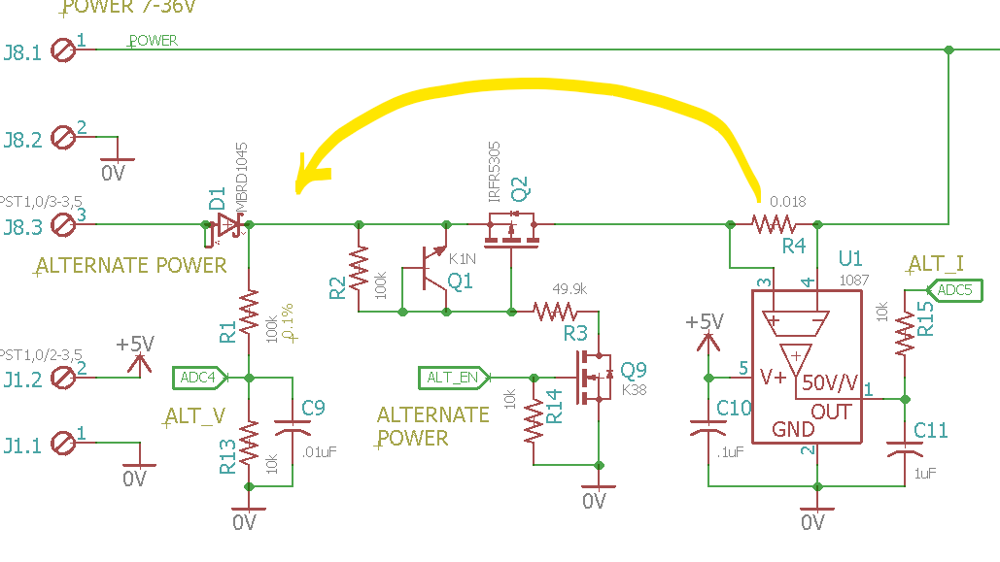
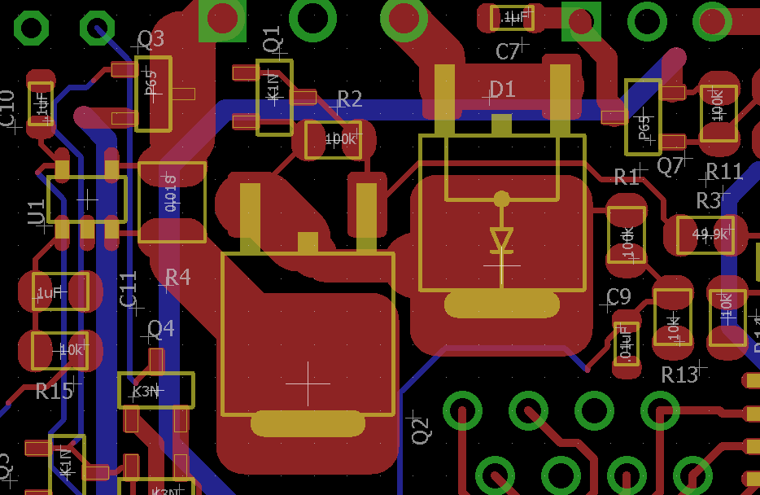

# Description

Some lessons I learned doing Gravimetric.

# Table Of Contents:

1. ^0 Power Protection 
1. ^0 Manager Should Do More
1. ^0 Alternat Power Diode

## ^0  Power Protection

U1 provides ALT_I curr sense but it causes power protection to fail.

Move U1 sense (R4) resistor between Q2 and D1 so that Q2 can block a reverse polarity.

I am not sure how to show a drawing of what needs to be done so it is time to improvise. 

That is a hack, and not clear what I did. D1 was never placed, so that is where I cut the trace between Q2 and D1. That node (between D1 and Q2) has reverse polarity protection now, and it should also protect the alternate power input as long as ALT_EN is not turned on when alternate power is reversed.

## ^0  Manager Should Do More

Analog: ALT_V, ALT_I, PWR_V, and PWR_I. Digital SHLD_VIN_EN and ALT_EN. If I can move some inputs around and use some of the ICSP pins, then the manager can take care of these functions, so the user program does not need to. Moving those functions will also take the R-Pi shutdown out of the hands of the user, which is probably an excellent idea.

## ^0  Alternat Power Diode

The MBRD1045 will protect a solar panel if it is connected wrong but will get too hot with about 3A. The IRFR5305 should be able to handle about 5A before it gets too hot. Replacing the MBRD1045 with an IRFR5305 requires that the body diode line up with the replaced diode and the gate can be controlled with the existing gate control (which has a 7V Zener from the NPN base to emitter).  The problem is that the battery can be shorted to a wrong connected solar panel, so that needs to difficult to enable with an improper connection.  

