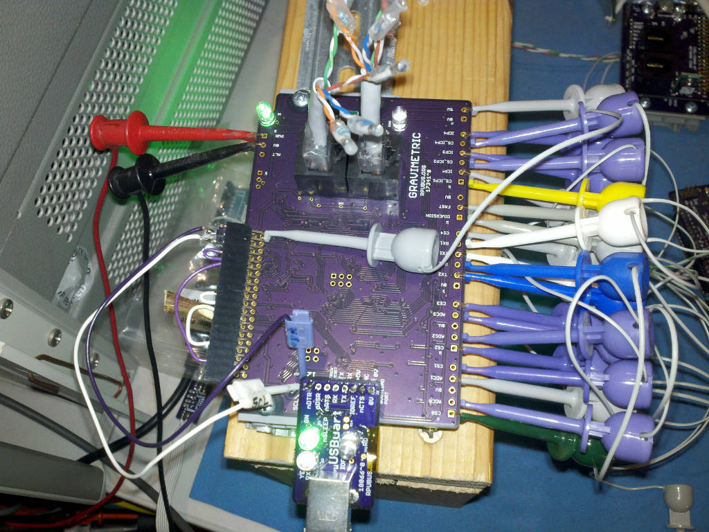

# Description

This is a list of Test preformed on each Gravimetric board after assembly.

# Table of References


# Table Of Contents:

1. Basics
2. Assembly check
3. IC Solder Test
4. Power Protection
5. Power Without SMPS
6. Bias +5V
7. Install Manager and Bootloader
8. Install SMPS
9. Self Test

## Basics

These tests are for an assembled Gravimetric board 17341^1 which may be referred to as a Unit Under Test (UUT). If the UUT fails and can be reworked then do so, otherwise it needs to be scraped. 

**Warning: never use a soldering iron to rework crystals or ceramic capacitors due to the thermal shock.**
    
Items used for test.




## Assembly check

After assembly check the circuit carefully to make sure all parts are soldered and correct, the device marking is labeled on the schematic and assembly drawing.

NOTE: U3 and U4 are not yet on the board, so +5V will not have power.


## IC Solder Test

U3 and U4 are not yet populated. Check that a diode drop to 0V is present from a circuit board pad that is connected to each of the pins of the integrated circuits, measure with a DMM's diode test set up for reversed polarity. Consult the schematic to determine which pins can be skipped (e.g. ground, power rail, ...).

This is a simplified In-Circuit Test (ICT). It could become more valuable if the node voltage driven with the current source was recorded for each tested location and then used with statistics to determine test limits for each location. 

## Power Protection

Apply a current limited (20mA) supply set with 5V to the PWR and 0V connector J8 pin 1 and pin 2 in reverse and verify that the voltage does not get through. Adjust the supply to 36V and verify no current is passing.

Apply a current limited (20mA) supply set with 5V to the ALT and 0V connector J8 pin 3 and pin 2 in reverse and verify that the input is 100k Ohm (e.g., 0.36mA@36V). Adjust the supply to 36V and verify.


## Power Without SMPS

Apply a current limited (20mA) supply set with 7V to the PWR and 0V connector J7 and verify that the voltage does get through. Adjust the supply so the LED is on and stable and measure voltage, adjust supply to 30V measure input current. 

NOTE for referance the zener voltage on Q5 is 7.75V at 30V.

```
{ "LEDON_V":[10.6,10.6,10.7,],
  "PWR@7V_mA":[0.125,0.07,0.061,],
  "PWR@30V_mA":[1.5,1.7,1.1,] }
```


## Bias +5V

Apply a 30mA current limited 5V source to +5V (J1). Check that the input current is for two blank MCU (e.g., manager and application). Turn off the power.

```
{ "I_IN_BLANKMCU_mA":[4.7,6.2,6.4,]}
```

Note: Internal clock/8 (=1MHz) and IO pins are floating (thus the current will change).


## Install Manager and Bootloader

Install Git and AVR toolchain on Ubuntu (18.04). 

```
sudo apt-get install make git gcc-avr binutils-avr gdb-avr avr-libc avrdude
```

Clone the Gravimetric repository.

```
cd ~
git clone https://github.com/epccs/Gravimetric
```

Connect a 5V supply with CC mode set at 50mA to +5V (J1). Connect the ISP tool to the manager programing port (J11). 

```
cd ~/Gravimetric/Manager/manager
make all
make isp
```

Verify that the uploader finished without errors and measure the input current to verify it is running with the crystal.

```
{ "I_IN_MGR_FLAGS_SET_mA":[19.4,opps,19.6,]}

Next upload the bootloader on the application controller port (J12).

```
cd ~/Gravimetric/Applications/Bootloader
make
make isp
```

Measure the input current, wait for the power to be settled. Turn off the power.

```
{ "I_IN_MGR_AND_APP_FLAGS_SET_mA":[33.5,34.2,33.8,]}
```

Add U3 to the board now.


## Install SMPS

With U3 installed measure its output voltage and input current with the supply set at 12.8V and a 30mA current limit.

```
{ "+5V_V":[4.9595,4.9747,4.9598,]}
```


## Self Test

Use a power supply with CV and CC mode. Set CC at 200mA and set CV to 12.8V then connect and power the UUT.

With a serial port setup for serial bootloading (see BOOT_PORT in Makefile) and optiboot installed on the DUT run 'make' and and 'make bootload' to upload a binary image in the application area of flash memory.

``` 
cd ~/Gravimetric/Applications/SelfTest
make all
make bootload
...
avrdude done.  Thank you.
make clean
``` 

Now connect with picocom (exit is C-a, C-x). 

``` 
#picocom -b 38400 /dev/ttyAMA0
# use bootload port
picocom -b 38400 /dev/ttyUSB0
...
Gravimetric Self Test date: Oct 18 2019
avr-gcc --version: 5.4.0
I2C provided address 0x31 from RPUadpt serial bus manager
adc reading for PWR_V: 358 int
PWR at: 12.756 V
ADC0 at ICP3&4 TERM /W all CS off: 0.000 V
ADC1 at ICP1 TERM /w all CS off: 0.000 V
ADC2 at ICP3&4 TERM /W all CS off: 0.000 V
ADC3 at ICP3&4 TERM /W all CS off: 0.000 V
ICP1 input should be HIGH with 0mA loop current: 1
CS_ICP1 on ICP1 TERM: 0.018 A
ICP1 /w 17mA on termination reads: 0
CS4 on ICP1 TERM: 0.022 A
CS_FAST on ICP1 TERM: 0.022 A
ICP3 input should be HIGH with 0mA loop current: 1
ICP3 one-shot delay: 0 mSec
ICP3 one-shot time: 2 mSec
CS_ICP3 on ICP3AND4 TERM: 0.018 A
ICP3 /w 8mA on termination reads: 0
   ADC0 reading used to calculate ref_intern_1v1_uV: 853 int
   calculated ref_intern_1v1_uV: 1085574 uV
REF_EXTERN_AVCC old value found in eeprom: 4978470 uV
REF_INTERN_1V1 old value found in eeprom: 1085791 uV
REF_EXTERN_AVCC from eeprom is same
ICP4 input should be HIGH with 0mA loop current: 1
CS_DIVERSION on ICP1 TERM: 0.022 A
CS_ICP4 on ICP4_TERM: 0.019 A
ICP4 /w 17mA on termination reads: 0
ICP4 one-shot delay: 0 mSec
ICP4 one-shot time: 2 mSec
PWR_I at no load : 0.010 A
CS0 on ICP3_TERM: 0.022 A
CS1 on ICP3_TERM: 0.022 A
CS2 on ICP3_TERM: 0.022 A
CS3 on ICP3_TERM: 0.022 A
TX1 loopback to RX1 == HIGH
TX1 loopback to RX1 == LOW
TX2 loopback to RX2 == HIGH
TX2 loopback to RX2 == LOW
SMBUS cmd 0 provided address 49 from manager
MISO loopback to MOSI == HIGH
MISO loopback to MOSI == LOW
SCK with Shutdown loopback == HIGH
I2C0 Shutdown cmd is clean {5, 1}
SCK with Shutdown loopback == LOW
I2C0 Shutdown Detect cmd is clean {4, 1}

Testmode: default trancever control bits
I2C0 Start Test Mode cmd was clean {48, 1}
I2C0 End Test Mode hex is Xcvr cntl bits {49, 0xD5}
Testmode: read  Xcvr cntl bits {50, 0xE2}
PWR_I /w no load using REF_EXTERN_AVCC: 0.011 A

Testmode: nCTS loopback to nRTS
I2C0 Start Test Mode cmd was clean {48, 1}
I2C0 End Test Mode hex is Xcvr cntl bits {49, 0xD5}
Testmode: set  Xcvr cntl bits {51, 0xA2}
Testmode: read  Xcvr cntl bits {50, 0x22}

Testmode: Enable TX pair driver
 I2C0 Start Test Mode cmd was clean {48, 1}
I2C0 End Test Mode hex is Xcvr cntl bits {49, 0xD5}
Testmode: set  Xcvr cntl bits {51, 0xF2}
Testmode: read  Xcvr cntl bits {50, 0xF2}
PWR_I /w TX pair load: 0.031 A

Testmode: Enable TX & RX(loopback) pair drivers
 I2C0 Start Test Mode cmd was clean {48, 1}
I2C0 End Test Mode hex is Xcvr cntl bits {49, 0xD5}
Testmode: set  Xcvr cntl bits {51, 0xD1}
Testmode: read  Xcvr cntl bits {50, 0xD1}
PWR_I /w TX and RX pairs loaded: 0.053 A
RX loopback checked

Testmode: Enable DTR pair driver
I2C0 Start Test Mode cmd was clean {48, 1}
I2C0 End Test Mode hex is Xcvr cntl bits {49, 0xD5}
Testmode: set  Xcvr cntl bits {51, 0xE6}
Testmode: read  Xcvr cntl bits {50, 0xE6}
PWR_I /w DTR pair load: 0.031 A
[PASS]
```
