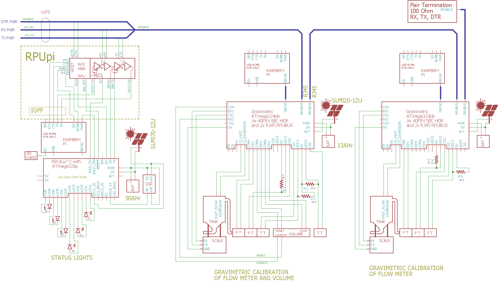

# Gravimetric

From <https://github.com/epccs/Gravimetric/>

## Overview

This board has an application micro-controller (ATmega324pb) with hardware set up for measuring some event times using ICP1 (flow pulse), ICP3 (start), and ICP4 (stop). It has two serial (UART) channels for user application, and a third serial connected to the multi-drop line for hosts to interface with. There are some current source outputs and some inputs that can measure with ADC or do digital IO. 

The board is a general-purpose controller in most ways, but there are a few areas aimed at the gravimetric calibration of flow measurement instruments. ICP1 is for measuring time events from flow meters (e.g., pulses). ICP3 is for a start event and ICP4 a stop event; ICP3 and ICP4 have one-shot pulse extenders.  Diversion control is a specialized circuit on this board; it starts when the ICP3 capture event occurs and ends with the ICP4 capture event. The ICP3 capture input will need its ISR to enable CS_DIVERSION, and the ICP4 capture ISR should disable CS_DIVERSION  for the diversion control to work correctly. Two serial inputs are available to connect a load cell amplifier (e.g., bit-bang an HX711 or serial with a calibrated scale) and a volume prover's inputs (e.g., bit-bang launch and ready or if a prover has serial). I2C is available to interface with a high-resolution ADC (but let's get the onboard stuff working first).

In previous boards, headers for a shield (e.g., RPUpi) were provided, but I removed those headers and added the multi-drop serial manager on this board. A 20x2 pinout for a Raspberry Pi SBC header is on the board but not populated. The R-Pi pins for I2C (SMBus) are connected to the manager, and SPI pins are connected to the application controller. The auxiliary power input is controlled by the manager and a state machine (battery manager) is in early development. The auxiliary power input is also used to operate a simple day-night state machine, which works if a solar panel is used. A host shutdown switch is used to operate a state machine that removes power from the SBC. The host shutdown state machine is also in the early stages and proven to be tricky. The hope is that the application can ignore some things that in the past needed to be considered (e.g., battery management and host shutdown).


## Status


## [Hardware](./Hardware)

Hardware files include a schematic, bill of materials, and various notes for testing and evaluation. [Layout] files are separate.

[Layout]: https://github.com/epccs/Eagle/

Licenses have mostly changed from LGPL to BSD, but some work remains.


## Example

Do not think of this as a PLC. A PLC runs a well-tested interpreter that emulates things (e.g., a logic sequence that may be done with a hardwired circuit) that historically served to implement control processes. The firmware that runs on this board is written in C or assembly (I do not recommend C++). The program needs careful reviewing and compiled into the binary instructions that operate the processor. I recommend dividing the software into parts that are as minimally functional as possible for testing. Testing and ensuring correctness is the user's responsibility.

The first UART on the application controller is used for a multi-drop serial bus that is interfaced with the serial hardware on a Single Board Computer (SBC). That serial link allows firmware uploads and general-purpose communication but for security goals, it does not cross network (IP) boundaries. The 40 pin header for a Raspberry Pi uses pins 8 and 10 for RX and TX, other SBC's should also work (I do not test them). The RJ45 connectors are for the multi-drop serial bus daisy chain connection with terminations at the ends. 



Diverting a calibration fluid onto a scale during a precisely measured time while measuring the meter flow pulses is how I am going to calibrate my meters. The start and stop events will be synchronized to the diversion control, and their event time can be compared to the flow meter events. The START and STOP can be from a volume that is being calibrated.


## AVR toolchain

This board uses the AVR toolchain. I use the one from Microchip that has been packaged for Debian (it is also on Ubuntu, Raspbian, and Windows with WSL). With the toolchain installed, the AVR application can compile localy. 

The frequently used files for this board are in the /lib folder. Each example application has its files and a Makefile in a separate folder. The toolchain is also available as packages. 

```
sudo apt-get install make git gcc-avr binutils-avr gdb-avr avr-libc avrdude
git clone https://github.com/epccs/Gravimetric
```

* [gcc-avr](https://packages.ubuntu.com/search?keywords=gcc-avr)
* [binutils-avr](https://packages.ubuntu.com/search?keywords=binutils-avr)
* [gdb-avr](https://packages.ubuntu.com/search?keywords=gdb-avr)
* [avr-libc](https://packages.ubuntu.com/search?keywords=avr-libc)
* [avrdude](https://packages.ubuntu.com/search?keywords=avrdude)

The software is a guide; it is in C. 
